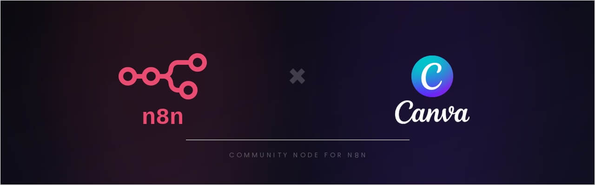
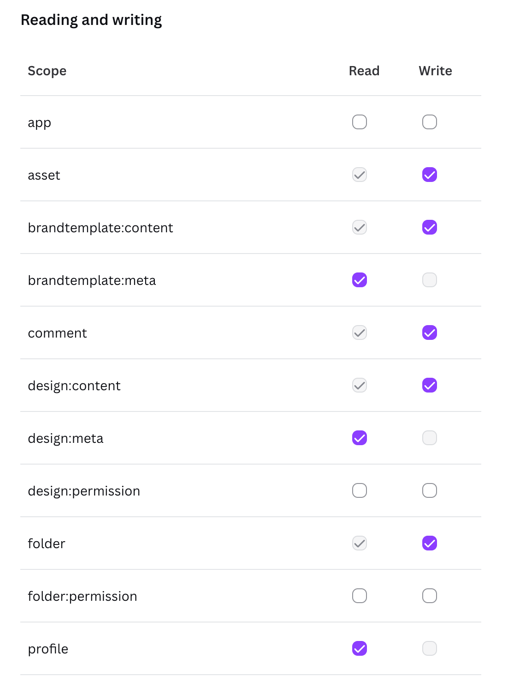

# n8n-nodes-canva



An n8n community node for the [Canva Connect API](https://www.canva.dev/docs/connect/). It lets you automate Canva workflows — creating and exporting designs, managing folders, uploading assets, running autofill jobs, and more — directly from n8n.

- [Installation](#installation)
- [Running n8n locally](#running-n8n-locally)
- [Credentials](#credentials)
- [Operations](#operations)
- [Usage notes](#usage-notes)
- [Resources](#resources)

## Installation

> This section is for people who already have an n8n instance running (cloud or self-hosted). If you want to test this node on your own machine first, see [Running n8n locally](#running-n8n-locally) below.

Follow the [installation guide](https://docs.n8n.io/integrations/community-nodes/installation/) in the n8n community nodes documentation.

## Running n8n locally

This section is for developers who want to run and test this node locally.

**Prerequisites:** Node.js 24+, npm.

1. Install dependencies and start n8n in dev mode:

   ```bash
   npm install
   npm run dev
   ```

   This builds the node, links it to a local n8n instance, and starts n8n at [http://127.0.0.1:5678](http://127.0.0.1:5678) with hot reload enabled. The **Canva** node will appear in the node picker under *Community Nodes*.

2. Follow the [Credentials](#credentials) section below to connect your Canva account.

   > **Note:** When running locally, use `http://127.0.0.1:5678/rest/oauth2-credential/callback` as the redirect URI in the Canva Developer Portal. Canva does not accept `localhost` — you must use the IP address.

## Credentials

This node uses **OAuth2 with PKCE** to authenticate with Canva.

### 1. Create a Canva integration

Go to the [Canva Developer Portal](https://www.canva.com/developers/integrations/connect-api) and create a new integration. Once created, open the integration's settings page to find your **Client ID**.

Still on that settings page, in the "Authentication" tab, add the following **Redirect URL**:

- **Cloud or self-hosted n8n:** `https://your-n8n-instance.com/rest/oauth2-credential/callback`
- **Local n8n:** `http://127.0.0.1:5678/rest/oauth2-credential/callback`

Then enable the following scopes:

| Scope                                                                                    | Used by                                           |
| ---------------------------------------------------------------------------------------- | ------------------------------------------------- |
| `asset:read` / `asset:write`                                                             | Asset resource                                    |
| `brandtemplate:content:read` / `brandtemplate:content:write` / `brandtemplate:meta:read` | Brand Template resource                           |
| `comment:read` / `comment:write`                                                         | Comment resource (Preview)                        |
| `design:content:read` / `design:content:write` / `design:meta:read`                      | Design, Autofill, Export, Merge, Resize resources |
| `folder:read` / `folder:write`                                                           | Folder resource                                   |
| `profile:read`                                                                           | User resource                                     |

Your integration's **Scopes** settings should look like this:

<!-- markdownlint-disable-next-line MD033 -->


### 2. Add the credential in n8n

1. In n8n, open **Credentials → New → Canva OAuth2 API**.
2. Enter the **Client ID** from the Canva Developer Portal.
3. Click **Connect my account** and complete the OAuth flow.

## Operations

### Asset

| Operation | Description                    |
| --------- | ------------------------------ |
| Delete    | Delete an asset                |
| Get       | Get metadata for an asset      |
| List      | List assets in a folder        |
| Update    | Update an asset's name or tags |
| Upload    | Upload an asset from a URL     |

### Autofill

| Operation  | Description                                                                   |
| ---------- | ----------------------------------------------------------------------------- |
| Create Job | Populate a brand template with data and wait for the resulting design (async) |

### Brand Template

| Operation           | Description                                   |
| ------------------- | --------------------------------------------- |
| Get                 | Get metadata for a brand template             |
| Get Dataset         | Get the autofill dataset for a brand template |
| List                | List brand templates accessible to the user   |
| Publish *(Preview)* | Publish a design as a brand template          |

### Comment *(Preview API)*

> ⚠️ All Comment operations use a Preview API that may have unannounced breaking changes and cannot be used in public integrations submitted for Canva review.

| Operation     | Description                                |
| ------------- | ------------------------------------------ |
| Create Reply  | Reply to a comment thread on a design      |
| Create Thread | Create a new comment thread on a design    |
| Get Reply     | Get a specific reply from a comment thread |
| Get Thread    | Get metadata for a comment thread          |
| List Replies  | List all replies in a comment thread       |

### Design

| Operation               | Description                                   |
| ----------------------- | --------------------------------------------- |
| Create                  | Create a new design                           |
| Get                     | Get metadata for a design                     |
| Get Dataset *(Preview)* | Get the autofill dataset for a design         |
| Get Export Formats      | Get the available export formats for a design |
| Get Pages               | Get metadata for pages in a design            |
| List                    | List designs in the user's projects           |

### Design Import

| Operation         | Description                                                                                    |
| ----------------- | ---------------------------------------------------------------------------------------------- |
| Create Import Job | Import an external file (e.g. PPTX, PDF) into Canva from a URL and wait for completion (async) |

### Export

| Operation  | Description                                                            |
| ---------- | ---------------------------------------------------------------------- |
| Create Job | Export a design to a file format and wait for the download URL (async) |

### Folder

| Operation  | Description                                           |
| ---------- | ----------------------------------------------------- |
| Create     | Create a new folder                                   |
| Delete     | Delete a folder                                       |
| Get        | Get metadata for a folder                             |
| List Items | List items inside a folder                            |
| Move Item  | Move a design, asset, or folder to a different folder |
| Update     | Rename a folder                                       |

### Merge *(Preview API)*

> ⚠️ All Merge operations use a Preview API that may have unannounced breaking changes and cannot be used in public integrations submitted for Canva review.

| Operation        | Description                                                                         |
| ---------------- | ----------------------------------------------------------------------------------- |
| Create Merge Job | Merge design pages by applying page operations to create or modify a design (async) |

### Resize

> 💎 The Resize API requires a Canva plan with premium features (such as Canva Pro). Users on the Canva Free plan have access to a limited trial.

| Operation         | Description                                                                       |
| ----------------- | --------------------------------------------------------------------------------- |
| Create Resize Job | Create a resized copy of a design in new dimensions or a different format (async) |

### User

| Operation        | Description                                                    |
| ---------------- | -------------------------------------------------------------- |
| Get Capabilities | Get the API capabilities available to the current user account |
| Get Me           | Get the User ID and Team ID of the authenticated user          |
| Get Profile      | Get the display name of the authenticated user                 |

## Usage notes

### Async operations

Several operations — **Autofill**, **Design Import**, **Export**, **Merge**, and **Resize** — create background jobs in Canva. This node automatically polls for completion and returns the final result once the job succeeds.

You can tune polling behaviour with two optional parameters available on each async operation:

- **Poll Interval** (default 3 s) — how often to check for job completion
- **Max Wait** (default 120 s) — maximum time to wait before throwing a timeout error

If a job fails, the node throws an error with the Canva error details.

### Preview APIs

Operations marked *(Preview)* use endpoints that are still in preview on the Canva platform. They may change without notice and **cannot be used in integrations submitted to Canva's public integration review**. Use them only for internal or development workflows.

### Moving items

The **Folder → Move Item** operation accepts any item ID (design, asset, or folder). To move an item to the top-level Projects folder, use `root` as the **To Folder ID**.

### Autofill dataset format

The **Autofill → Create Job** operation requires a `data` object whose keys must match the dataset fields returned by **Brand Template → Get Dataset**. Use the Get Dataset operation first to discover the correct field names.

## Resources

- [n8n community nodes documentation](https://docs.n8n.io/integrations/community-nodes/)
- [Canva Connect API reference](https://www.canva.dev/docs/connect/api-reference/)
- [Canva Developer Portal](https://www.canva.dev/)
